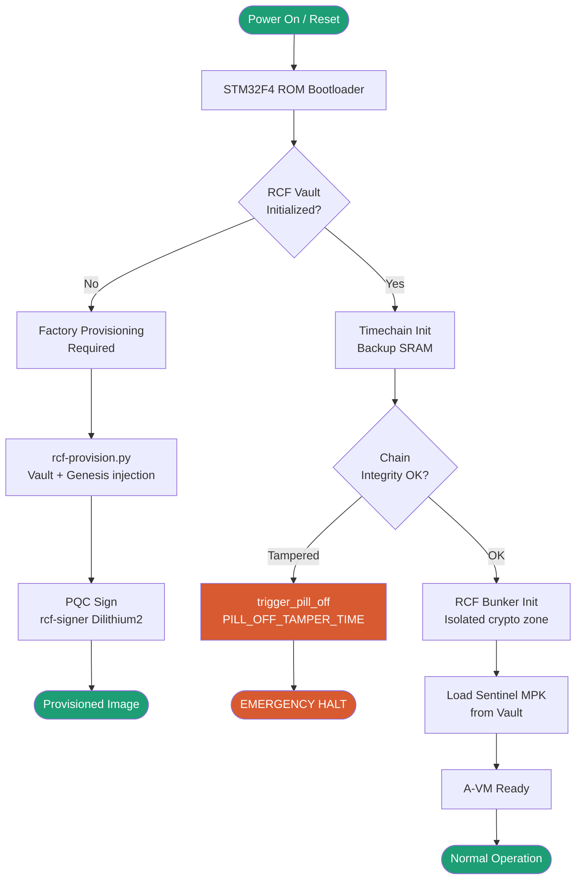
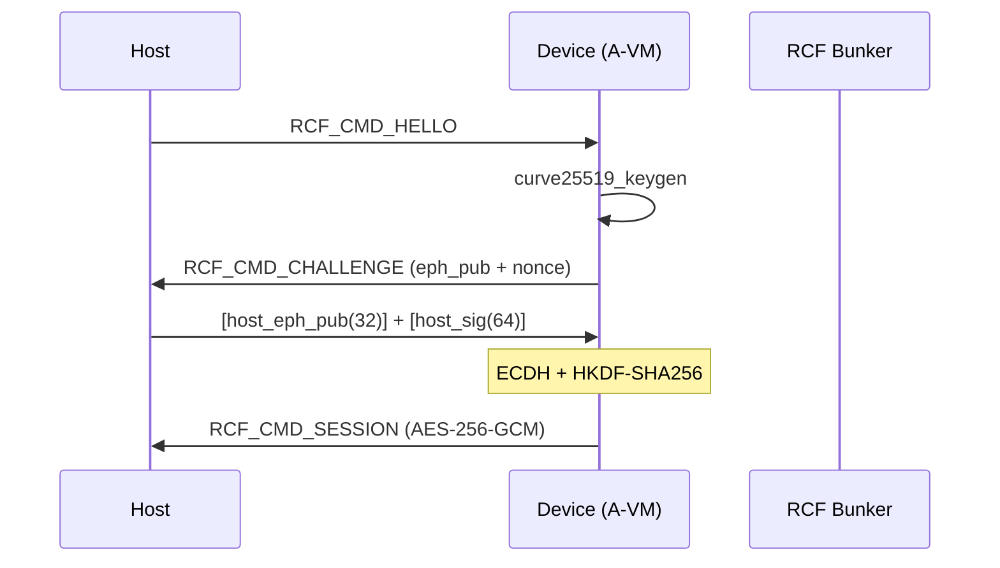

# RCF-SPEC — Restricted Correlation Framework Specification

**Version:** 1.3 — "The Integrity Release"  
**Status:** Active  
**Author:** Aladdin Aliyev · Sovereign Code Initiative  
**Supersedes:** RCF-SPEC v1.2.8  

---

## Table of Contents

1. [Overview](#1-overview)
2. [Core Principles](#2-core-principles)
3. [Protection Levels](#3-protection-levels)
4. [Secure Boot Flow](#4-secure-boot-flow)
5. [Session Protocol](#5-session-protocol)
6. [Aurora Virtual Machine (A-VM)](#6-aurora-virtual-machine-a-vm)
7. [Timechain & Anti-Rollback](#7-timechain--anti-rollback)
8. [RCF Bunker](#8-rcf-bunker)
9. [Cryptographic Primitives](#9-cryptographic-primitives)
10. [Audit & Compliance](#10-audit--compliance)
11. [Module Index](#11-module-index)

---

## 1. Overview

The **Restricted Correlation Framework (RCF)** is a multi-layer security protocol that operates across three domains simultaneously:

| Domain | Component | Purpose |
|---|---|---|
| **Software** | RCF-PL License + rcf-cli | IP protection, marker enforcement |
| **Firmware** | Aurora Access / A-VM | Tamper-resistant code execution |
| **Hardware** | RCF Bunker + Timechain | Root-of-Trust, anti-rollback |

---

## 2. Core Principles

### 2.1 Visibility ≠ Rights
Visibility is granted unconditionally for audit purposes. Usage (replication, AI training) requires explicit authorization.

### 2.2 Layered Defense
RCF enforces protection at four independent layers: Legal, Tooling, Firmware, Hardware.

---

## 3. Protection Levels

| Marker | Hex (wire) | Scope |
|---|:---:|---|
| `[RCF:PUBLIC]` | `0x01` | Architecture, interfaces, public APIs |
| `[RCF:PROTECTED]` | `0x02` | Core methodology, algorithmic logic |
| `[RCF:RESTRICTED]` | `0x03` | Sensitive implementation, key material |

---

## 4. Secure Boot Flow

### 4.1 Boot Stages
1. **ROM:** Integrity validation.
2. **Vault Check:** Provisioning verification via Backup SRAM.
3. **Timechain:** Monotonic time and rollback protection.
4. **Bunker:** Cryptographic isolation.
5. **A-VM:** Signed .acode execution readiness.

---

## 5. Session Protocol

---

## 6. Aurora Virtual Machine (A-VM)

### 6.1 Purpose
The A-VM executes exclusively verified `.acode` modules signed with Dilithium2.

---

## 7. Timechain & Anti-Rollback
A SHA-256 linked list stored in Backup SRAM (VBAT-powered).

---

## 9. Cryptographic Primitives
- **Curve25519**: Session ECDH.
- **AES-256-GCM**: Frame encryption.
- **Dilithium2 (NIST PQC)**: Module signing.
- **SHA-256**: HW accelerated integrity.

---

*© 2026 Aladdin Aliyev · All rights reserved.*  
*Protected under RCF-PL v1.3 — Sovereignty via Restricted Correlation.*
